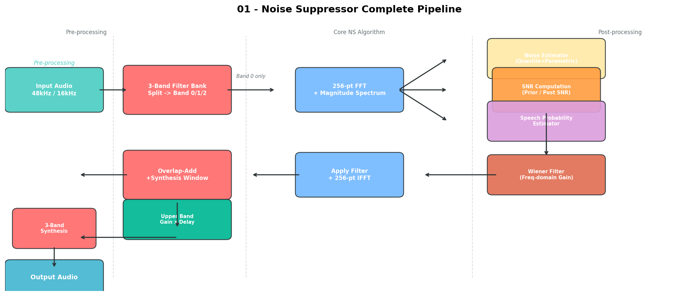
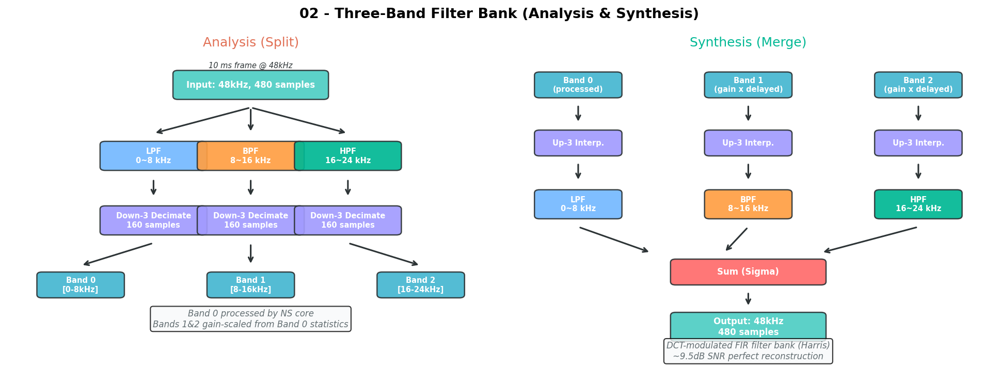
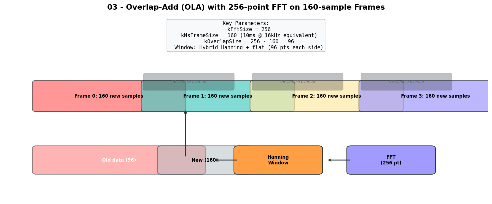
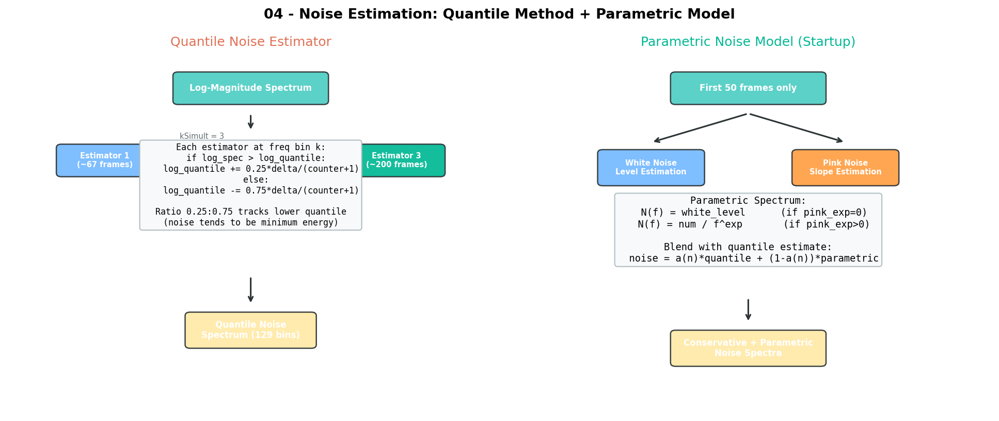
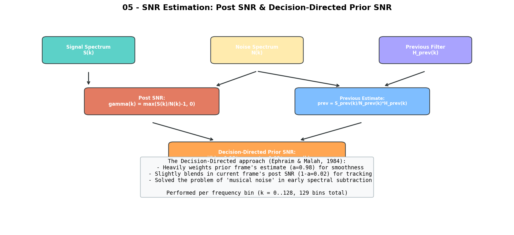
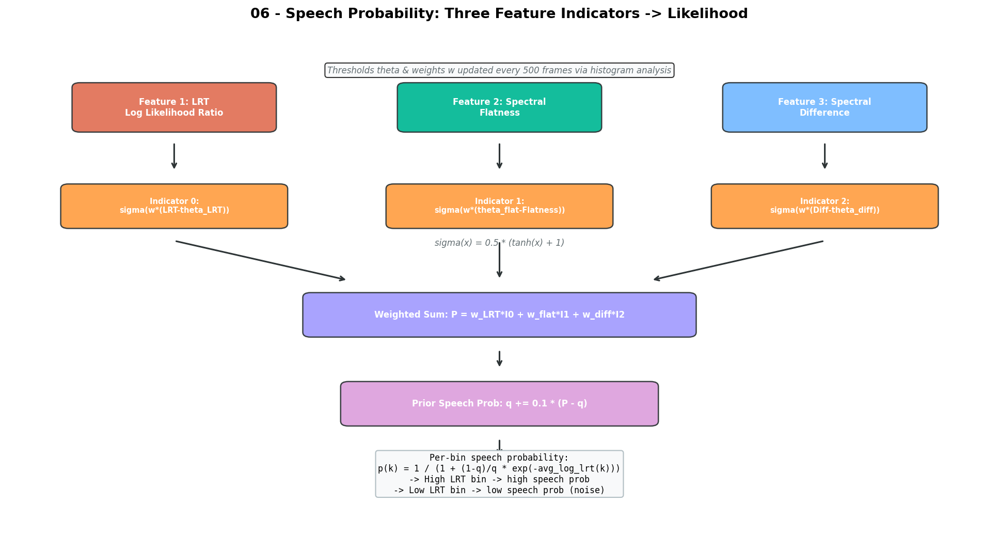
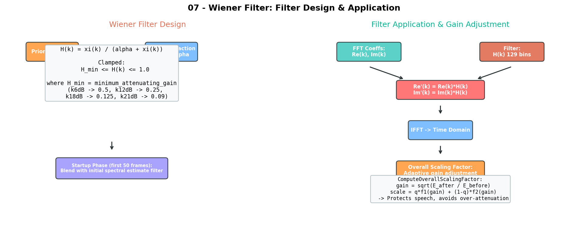
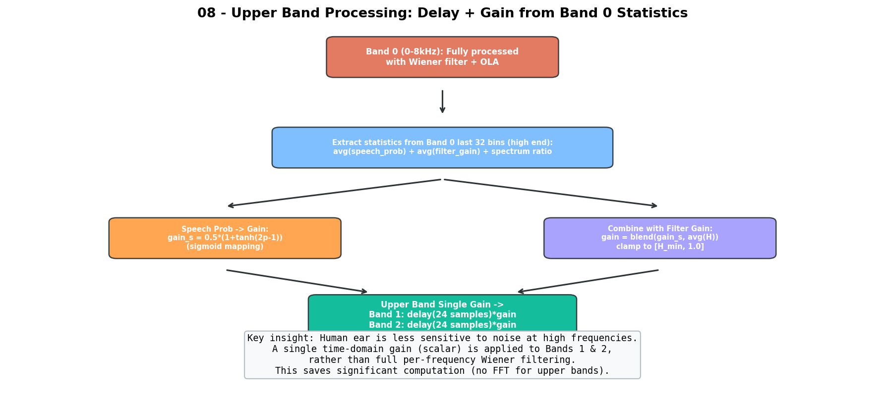

# WebRTC Noise Suppressor (NS) 算法深度解析与学习指南

> **适用读者**: DSP算法工程师，具备信号处理基础（FFT、滤波器、随机信号）但未接触过语音降噪算法。
>
> **源码出处**: WebRTC AudioProcessing 模块中的 NoiseSuppressor (约2019版)。本项目将其从 C++ 移植到纯 C 语言，面向嵌入式 MCU 部署。
>
> **目标**: 本文档"嚼碎"这个算法，让你从零搭建起完整的理解框架，并能独立阅读和修改源码。

---

## 目录

1. [概述：这个算法在做什么](#1-概述这个算法在做什么)
2. [全局架构与数据流](#2-全局架构与数据流)
3. [Part A: 前置处理 —— 分频器 (Filter Bank)](#3-part-a-前置处理--分频器-filter-bank)
4. [Part B: 帧拼接与 FFT (OLA 框架)](#4-part-b-帧拼接与-fft-ola-框架)
5. [Part C: 噪声估计 —— 算法的"眼睛"](#5-part-c-噪声估计--算法的眼睛)
6. [Part D: SNR 估计 —— 区分信号与噪声的"尺子"](#6-part-d-snr-估计--区分信号与噪声的尺子)
7. [Part E: 语音概率估计 —— 多特征融合的"判断器"](#7-part-e-语音概率估计--多特征融合的判断器)
8. [Part F: Wiener 滤波 —— 降噪的"手术刀"](#8-part-f-wiener-滤波--降噪的手术刀)
9. [Part G: 后处理 —— 增益调整与高频带处理](#9-part-g-后处理--增益调整与高频带处理)
10. [Part H: Analyze 与 Process 的双阶段设计](#10-part-h-analyze-与-process-的双阶段设计)
11. [关键公式速查表](#11-关键公式速查表)
12. [学习路线图：从入门到精通](#12-学习路线图从入门到精通)
13. [推荐阅读与参考文献](#13-推荐阅读与参考文献)

---

## 1. 概述：这个算法在做什么

### 1.1 一句话总结

这是一个**基于统计信号模型的单通道频域降噪算法**。它在频域中对每个频率点独立估计语音存在概率，然后用 Wiener 滤波器对噪声占主导的频率成分进行衰减，最终实现噪声抑制。

### 1.2 核心思想

降噪的终极难题是：**"不知道哪部分是噪声，哪部分是语音"**。这个算法的解法分三步：

| 步骤 | 做什么 | 类比 |
|------|--------|------|
| **Noise Estimation** | 持续追踪噪声的频谱形状 | "学会噪声长什么样" |
| **Speech Probability** | 判断每个频率点是语音还是噪声 | "判断哪些频率是语音" |
| **Wiener Filtering** | 对噪声频率大幅衰减，对话音频率保留 | "手术刀式精准切除噪声" |

### 1.3 配置参数

算法提供 4 档降噪强度（`SuppressionLevel`）：

| 级别 | 最小衰减增益 | 过减因子 | 衰减量 |
|------|-------------|---------|--------|
| k6dB  | 0.5   | 1.0  | -6 dB  |
| k12dB | 0.25  | 1.0  | -12 dB |
| k18dB | 0.125 | 1.1  | -18 dB |
| k21dB | 0.09  | 1.25 | -21 dB |

> **关键体会**: `minimum_attenuating_gain` 是 Wiener 滤波器的"地板"——噪声再大也不会把增益降到这个值以下，防止产生不自然的"死寂"感。`over_subtraction_factor` 相当于多减一点，避免噪声残留。

---

## 2. 全局架构与数据流

先看总览图，建立全局认知：



算法分为三大阶段，按前后依赖串行：

```
[原始音频 48kHz/16kHz]
        |
        v
[ThreeBandFilterBank::Analysis]  <-- Part A: 分频
        |
        v
[取 Band 0 (0~8kHz) 做 256-pt FFT]  <-- Part B: OLA + FFT
        |
        +-----> [NoiseEstimator]           <-- Part C
        +-----> [ComputeSnr (Prior/Post)]  <-- Part D
        +-----> [SpeechProbabilityEstimator] <-- Part E
        |
        v
[WienerFilter::Update]  <-- Part F: 计算滤波器 H(k)
        |
        v
[Apply H(k) to FFT coeffs, then IFFT]  <-- Part F: 应用到时域
        |
        v
[OverlapAdd + GainAdjustment]  <-- Part G: 后处理
        |
        v
[Band 1/2: Delay + 单一增益缩放]  <-- Part G: 高频快速处理
        |
        v
[ThreeBandFilterBank::Synthesis]  <-- 合回全频带
        |
        v
[输出音频]
```

**核心参数速览**：

| 符号 | 值 | 含义 |
|------|-----|------|
| `kFftSize` | 256 | FFT 点数 |
| `kNsFrameSize` | 160 | 每帧样本数（10ms@16kHz 等效） |
| `kFftSizeBy2Plus1` | 129 | 正频率 bin 数（含直流+奈奎斯特） |
| `kOverlapSize` | 96 (=256-160) | 帧间重叠样本数 |

---

## 3. Part A: 前置处理 —— 分频器 (Filter Bank)



### 3.1 为什么要分频？

48kHz 采样率下，奈奎斯特频率是 24kHz。如果对整个 0~24kHz 做高分辨率频域处理，计算量很大。但人耳对高频噪声不敏感，所以：

- **Band 0 (0~8kHz)**: 做**完整的频域降噪**（FFT + Wiener 滤波）
- **Band 1 (8~16kHz)**: 只用一个**标量增益**缩放
- **Band 2 (16~24kHz)**: 同样只用一个**标量增益**缩放

### 3.2 实现细节

采用的是一种基于 **DCT 调制的 3 通道 FIR 滤波器组**（Harris 多速率信号处理方法）：

- 原型低通滤波器: 通带纹波 0.3dB，阻带衰减 40dB，延迟 24 样本
- 分析端: 对 480 样本的全频带帧 → 滤波 → 3 倍下采样 → 3 个 160 样本的子带
- 合成端: 3 倍上采样 → 滤波 → 求和 → 480 样本全频带

> **重要**: 这个滤波器组**不满足完美重建**（PR），但近似重建 SNR 约 9.5dB，对于降噪场景已足够。

### 3.3 学习切入点

阅读 `three_band_filter_bank.h/cc`，理解 `Analysis()` 和 `Synthesis()` 函数。核心是多相滤波 + 下/上采样。

---

## 4. Part B: 帧拼接与 FFT (OLA 框架)



### 4.1 OLA 的必要性

降噪是对 FFT 系数乘以增益滤波器，而直接分帧做 FFT 会产生**块效应**（blocking artifacts）。解决方法是 **Overlap-Add (OLA)**：

1. 每帧 160 样本，但做 256 点的 FFT
2. 前 96 点来自上一帧的末尾（overlap 区）
3. 加窗（混合 Hanning + 平坦窗）平滑帧边界
4. 处理完后，OLA 合成输出 160 样本

### 4.2 窗函数

代码中的窗是 96 点上升 Hanning + 64 点平坦 + 96 点下降 Hanning：

```
kBlocks160w256FirstHalf[i] = sin^2(pi * i / 192),  i = 0..95
flat region: value = 1.0,                          i = 96..159
mirror from kBlocks160w256FirstHalf,                i = 160..255
```

> **为什么用这种混合窗？** 纯 Hanning 窗会过度衰减帧边缘信号，平坦区保证帧主体信号不受影响。

### 4.3 代码关键函数

读 `NoiseSuppressor.cc` 中的：
- `FormExtendedFrame()`: 拼接历史数据 + 当前帧
- `ApplyFilterBankWindow()`: 加窗
- `OverlapAndAdd()`: 合成输出

---

## 5. Part C: 噪声估计 —— 算法的"眼睛"



这是整个算法**最核心也最精妙**的部分。噪声估计的好坏直接决定降噪效果。

### 5.1 为什么噪声估计难？

噪声是非平稳的——风扇声、键盘声、空调声时刻在变。而且我们只能在**信号+噪声的混合体中**估计噪声，不能单独拿出来。

### 5.2 方法一：Quantile Noise Estimator（分位数噪声估计器）

**核心思想**: 在语音存在的间隙（pause），频谱能量最低；噪声能量倾向于处于某个较低分位数。

算法为每个频率 bin 维护 3 个**并行估计器**（`kSimult = 3`），分别对应约 67 帧、133 帧、200 帧的跟踪窗口：

```
对每个频率 bin k:
  log_spec = log(|X(k)|)
  
  if log_spec > log_quantile:
    log_quantile += 0.25 * delta / (counter + 1)   # 上升慢
  else:
    log_quantile -= 0.75 * delta / (counter + 1)   # 下降快
```

**不对称更新比例 0.25:0.75** 是关键设计——噪声倾向于低估（取较低分位数），所以对低于当前估计值的信号反应更快（权重 0.75），对高于当前估计的信号反应更慢（权重 0.25）。

另外维护了一个 `density` 估计来动态调整步长 `delta`。

> **通俗理解**: 这就像一个"追低不追高"的自动追踪器——频谱突然变大（可能是语音来了）时缓慢更新，频谱变小时（可能是语音走了）快速更新。多次循环后，它自然追踪到频谱的**底部包络**，也就是噪声。

### 5.3 方法二：Parametric Noise Model（参数化噪声模型）- 启动阶段专用

前 50 帧（`kShortStartupPhaseBlocks`），用简单的参数化模型辅助：

- **白噪声分量**: 所有频率相同的能量
- **粉红噪声分量**: 能量按 \(1/f^{\alpha}\) 衰减

通过对数域的线性回归估计白噪声电平和粉红噪声指数：

```
log(N(f)) = log(num) - exp * log(f)    (if pink noise)
N(f) = white_level                      (if white noise only)
```

启动阶段将 quantile 估计与 parametric 估计线性混合：

```
noise(k) = (n/50) * quantile(k) + (1-n/50) * parametric(k)
```

### 5.4 方法三：Conservative Noise Spectrum（保守噪声谱）

`PostUpdate()` 中还维护了一个**保守噪声谱**——只在语音概率低（`prob < 0.2`）时更新，作为模板噪声谱供后续的 Spectral Difference 特征计算使用：

```
conservative_noise(k) += 0.05 * (signal(k) - conservative_noise(k))   # 仅在噪声段更新
```

### 5.5 噪声估计的最终更新

`PostUpdate()` 拿到每帧的语音概率后，进行**软判决更新**：

- 语音概率高 → 用 **大平滑系数 γ=0.99**（几乎不动，避免语音污染噪声估计）
- 语音概率低 → 用 **小平滑系数 γ=0.9**（允许更新）

同时保证噪声估计**只能下降不能上升**（取两者中的 min），防止语音成分混入噪声估计。

### 5.6 学习切入点

1. 先理解 `quantile_noise_estimator.cc` 的 1/4 vs 3/4 更新逻辑
2. 再理解 `noise_estimator.cc::PostUpdate()` 中的语音概率驱动的自适应平滑
3. 思考：为什么需要 3 个并行的 quantile estimator？

---

## 6. Part D: SNR 估计 —— 区分信号与噪声的"尺子"



### 6.1 Post SNR（后验信噪比）

最简单的 SNR，直接从当前帧计算：

$$\gamma(k) = \max\left(\frac{|X(k)|}{N(k)} - 1,\ 0\right)$$

- `|X(k)|` 是当前帧的幅度谱
- `N(k)` 是噪声谱估计
- 减去 1 是为了去除噪声的贡献（假设噪声与信号不相关，能量相加）

### 6.2 Prior SNR（先验信噪比）—— Decision-Directed 方法

这是 Ephraim & Malah (1984) 的经典贡献，解决了早期谱减法中"音乐噪声"的顽疾：

$$\xi(k) = \alpha \cdot \xi_{\text{prev}}(k) + (1-\alpha) \cdot \gamma(k)$$

其中：

$$\xi_{\text{prev}}(k) = \frac{|X_{\text{prev}}(k)|}{N_{\text{prev}}(k)} \cdot H_{\text{prev}}(k)$$

参数 `α = 0.98`——极度依赖前一帧的估计，仅用 2% 的当前帧信息。

**为什么要 0.98 这么极端的平滑？**

- 如果 α 太小（如 0.5），prior SNR 会剧烈波动
- Wiener 滤波器 `H(k) = ξ/(α+ξ)` 也会剧烈波动
- 在噪声段，剧烈波动的滤波器会在频域产生**孤立的尖峰**，IFFT 后听起来像"音乐声"
- α=0.98 保证了滤波器极度平滑，几乎消除了音乐噪声

> **直观理解**: Decision-Directed 像是在说"根据历史经验，我判断这个频率点的 SNR 应该和上一帧差不多，除非当前帧的证据特别强"。

### 6.3 学习切入点

- 这是整个降噪理论中最重要的公式之一
- 建议阅读 Ephraim & Malah (1984) 原始论文
- 在代码中对比 `ComputeSnr()` 和 `WienerFilter::Update()`，两者都计算了 prior SNR（分别在 Analyze 和 Process 阶段独立计算）

---

## 7. Part E: 语音概率估计 —— 多特征融合的"判断器"



### 7.1 为什么要估计语音概率？

有了噪声谱和 SNR，还不够。我们还需要回答：**"当前帧整体上是在说话还是静音？"** 以及 **"每个频率 bin 是语音还是噪声？"**。

这个模块输出两个关键量：
1. **Prior Speech Probability `q`**: 帧级别的先验语音概率（标量）
2. **Per-bin Speech Probability `p(k)`**: 每个频率 bin 的语音概率（129 维向量）

### 7.2 三个特征量

#### 特征 1：Log Likelihood Ratio (LRT)

基于二元假设检验（H0: 纯噪声，H1: 语音+噪声），每个频率 bin 的 LRT 为：

$$\text{LRT}(k) = \frac{p(X(k)|H_1)}{p(X(k)|H_0)} = \exp\left(\frac{\xi(k)\gamma(k)}{1+\xi(k)} - \ln(1+\xi(k))\right)$$

代码中对 LRT 做了时间和频率上的平均，得到一个标量 `lrt` 和一个 129 维向量 `avg_log_lrt`。

- **LRT 大** → 语音可能性大
- **LRT 小** → 噪声可能性大

#### 特征 2：Spectral Flatness（谱平坦度）

$$\text{Flatness} = \frac{\sqrt[N]{\prod |X(k)|}}{\frac{1}{N}\sum |X(k)|} = \frac{\text{几何平均}}{\text{算术平均}}$$

- 语音的频谱有共振峰结构（不平坦） → Flatness 小
- 白噪声频谱平坦 → Flatness 接近 1

#### 特征 3：Spectral Difference（谱差异）

当前帧频谱与"保守噪声模板"之间的差异。本质上计算的是信号谱对噪声模板的"偏差"：

$$\text{Diff} = \text{Var}(|X|) - \frac{\text{Cov}(|X|, |N_{\text{cons}}|)^2}{\text{Var}(|N_{\text{cons}}|)}$$

- Diff 大 → 当前频谱与噪声模板差异大 → 语音可能性大
- Diff 小 → 当前频谱接近噪声模板 → 噪声可能性大

### 7.3 特征融合与阈值自适应

三个特征各产生一个 Indicator（通过 sigmoid 函数映射到 0-1）：

$$I_j = \frac{1}{2}\left[\tanh(w \cdot (\text{feature}_j - \theta_j)) + 1\right]$$

然后加权融合：

$$P = w_{\text{LRT}} \cdot I_0 + w_{\text{flat}} \cdot I_1 + w_{\text{diff}} \cdot I_2$$

**阈值 θ 和权重 w 是自适应的！** 每 500 帧（`kFeatureUpdateWindowSize`），通过直方图分析重新计算：

1. 收集 500 帧的三个特征的直方图
2. 在 LRT 直方图的低区间找均值 → θ_LRT
3. 在 Flatness/Diff 直方图找两个最大峰值 → θ_flat, θ_diff
4. 根据峰值质量和 LRT 波动性决定是否启用该特征
5. 自动分配权重

> **这是算法"自学习"的核心**——系统不需要事先知道"什么是噪声"，它通过 500 帧的统计分布自适应地找到判别阈值。

### 7.4 最终 per-bin 语音概率

$$p(k) = \frac{1}{1 + \frac{1-q}{q} \cdot \exp(-\text{avg\_log\_lrt}(k))}$$

这是 Bayes 公式的直接应用——将帧级别的先验概率 q 和频率 bin 级别的 LRT 结合。

### 7.5 学习切入点

1. 先理解 LRT 的定义（二元假设检验 → 似然比）
2. 理解三个特征的物理意义
3. 理解直方图自适应阈值的机制（`Histograms` + `PriorSignalModelEstimator`）
4. 对比 `speech_probability_estimator.cc` 的流程

---

## 8. Part F: Wiener 滤波 —— 降噪的"手术刀"



### 8.1 Wiener 滤波器公式

对于每个频率 bin k，Wiener 滤波器是一个**实数值增益**：

$$H(k) = \frac{\xi(k)}{\alpha + \xi(k)}$$

然后钳位：

$$H(k) = \text{clamp}(H(k),\ H_{\min},\ 1.0)$$

其中：

| 符号 | 含义 |
|------|------|
| `ξ(k)` | Prior SNR（决策导向法估计） |
| `α` | 过减因子（over_subtraction_factor），1.0 ~ 1.25 |
| `H_min` | 最小增益（minimum_attenuating_gain），0.09 ~ 0.5 |

### 8.2 直观理解

$$H(k) = \frac{\text{SNR}}{1 + \text{SNR}}$$

- **高 SNR（语音）**: ξ 很大 → H ≈ 1 → 不衰减
- **低 SNR（噪声）**: ξ 很小 → H ≈ ξ/α → 大量衰减
- **极端情况**: H 被 cap 在 `H_min`，防止过度衰减

### 8.3 启动阶段的特殊处理

前 50 帧 (`kShortStartupPhaseBlocks`)，将 Wiener 滤波器与一个**初始谱估计滤波器**混合：

```
initial_filter(k) = (sum_spectrum - alpha * parametric_noise) / sum_spectrum
H_final(k) = blend(H_wiener(k), H_initial(k), frame_count/50)
```

这是一种 bootstrap 策略——在系统还没有足够时间收敛时，用参数化噪声模型辅助。

### 8.4 Overall Scaling Factor（整体增益调整）

应用 Wiener 滤波后，计算整体增益因子：

$$\text{gain} = \sqrt{\frac{E_{\text{after}}}{E_{\text{before}}}}$$

然后根据 gain 的大小和语音概率 q 计算一个自适应缩放因子，防止**过度衰减**（over-attenuation）：

- 如果 gain > 0.5（噪声被有效压制）→ 适当补偿语音段
- 如果 gain < 0.5（可能过度衰减了）→ 适当回拉

最终乘以整个时域输出帧。

### 8.5 学习切入点

1. Wiener 滤波器是最优线性滤波器（MMSE 准则），在频域假设各 bin 独立
2. 核心是 prior SNR 驱动的增益计算
3. 启动阶段的混合策略体现了"鲁棒初始化"思路

---

## 9. Part G: 后处理 —— 增益调整与高频带处理



### 9.1 Upper Band 处理

Band 1 (8-16kHz) 和 Band 2 (16-24kHz) **不做 FFT 和逐频点处理**，而是：

1. 从 Band 0 的高频部分（最后 32 个 bin，对应约 6-8kHz）提取统计量：
   - `avg_prob_speech`：平均语音概率
   - `avg_filter_gain`：平均滤波器增益
2. 用 sigmoid 函数将语音概率映射为增益：
   - `gain = 0.5 * (1 + tanh(2 * avg_prob_speech - 1))`
3. 与 Band 0 平均增益混合
4. 延迟 24 样本（补偿 Filter Bank 的延迟）后乘以增益

> **设计哲学**: 高频处理是"低保真"的——用一个标量增益就够了，因为人耳对高频噪声不敏感，且高频语音信息有限。这节省了大量计算（无需 FFT）。

### 9.2 输出限幅

最终输出钳位到 [-32768, 32767]（16-bit PCM 范围）。

---

## 10. Part H: Analyze 与 Process 的双阶段设计

这个算法有一个巧妙的两阶段设计：

| 阶段 | 调用时机 | 做了什么 |
|------|---------|---------|
| **Analyze()** | 在 AEC (回声消除) 之前 | 估计噪声谱 + 估计语音概率 |
| **Process()** | 在 AEC 之后 | 用已估计的噪声谱设计 Wiener 滤波器并应用 |

**为什么分开？**

1. Analyze 在回声消除之前——回声消除会引入舒适噪声（comfort noise），干扰噪声估计
2. Process 在回声消除之后——此时信号中已没有远端回声，可以放心降噪
3. Analyze 中计算的 `prev_analysis_signal_spectrum` 被 Process 复用，用于判断"信号是否在 Analyze 和 Process 之间被改变了"（例如被 AEC 压制），从而调整高频增益

---

## 11. 关键公式速查表

| 名称 | 公式 | 源码位置 |
|------|------|---------|
| 幅度谱 | `|X(k)| = sqrt(Re^2 + Im^2) + 1` | `NoiseSuppressor.cc:ComputeMagnitudeSpectrum` |
| Post SNR | `γ(k) = max(|X(k)|/N(k)-1, 0)` | `NoiseSuppressor.cc:ComputeSnr` |
| Prior SNR (DD) | `ξ(k) = 0.98*prev + 0.02*γ(k)` | `NoiseSuppressor.cc:ComputeSnr` |
| Wiener Gain | `H(k) = ξ(k)/(α + ξ(k))` | `wiener_filter.cc:Update` |
| LRT (avg) | `avg_log_lrt(k) += 0.5*(bessel - log(1+2ξ) - avg)` | `signal_model_estimator.cc:UpdateSpectralLrt` |
| Spectral Flatness | `GeomMean(|X|) / ArithMean(|X|)` | `signal_model_estimator.cc:UpdateSpectralFlatness` |
| Speech Probability | `p(k) = 1/(1 + (1-q)/q * exp(-LRT(k)))` | `speech_probability_estimator.cc:Update` |
| Quantile Update | `logQ += (0.25 or -0.75)*delta/(counter+1)` | `quantile_noise_estimator.cc:Estimate` |
| Noise Smoothing | `N(k) = γ*N_prev(k) + (1-γ)*(prob_nonspeech*|X(k)| + prob_speech*N_prev(k))` | `noise_estimator.cc:PostUpdate` |

---

## 12. 学习路线图：从入门到精通

### 第一阶段：建立框架认知（1-2天）

1. **阅读本文档全文**，理解每张流程图
2. **看一遍 `NoiseSuppressor.cc::Analyze()` 和 `Process()`**，不追求细节，形成"大流程"概念
3. **画出自己的流程图**，标注数据尺寸（160 → 256 → 129 → 256 → 160）

### 第二阶段：逐一攻破子模块（3-5天）

按依赖顺序依次深入：

```
Day 1: Frame/FFT/OLA
  - 阅读: NoiseSuppressor.cc 中的 FormExtendedFrame, ApplyFilterBankWindow, OverlapAndAdd
  - 理解: 256-pt FFT, 160 样本帧, 96 样本 overlap 的关系
  - 验证: 自己手算一帧的输入输出维度

Day 2: Quantile Noise Estimator
  - 阅读: quantile_noise_estimator.cc
  - 核心: 1/4 vs 3/4 不对称更新逻辑
  - 思考: 为什么用 3 个并行估计器？(kSimult=3)
  - 验证: 跟踪一帧 log_quantile 的变化过程

Day 3: SNR + Speech Probability
  - 阅读: NoiseSuppressor.cc::ComputeSnr
  - 阅读: speech_probability_estimator.cc
  - 核心: Decision-Directed 先验 SNR, LRT/Flatness/Diff 三个特征
  - 验证: 用纸笔推演一次 3 个指标的融合过程

Day 4: Wiener Filter + Upper Band
  - 阅读: wiener_filter.cc + ComputeUpperBandsGain
  - 核心: H(k) = ξ/(α+ξ), 启动阶段的混合
  - 验证: 计算几个 SNR 值对应的 H(k)，感受 curve

Day 5: Histograms + Prior Model (自适应阈值)
  - 阅读: histograms.cc + prior_signal_model_estimator.cc
  - 核心: 每 500 帧自适应更新阈值和权重
  - 思考: 为什么这种自适应是必要的？
```

### 第三阶段：纵向贯穿（2-3天）

1. **用调试器单步跟踪一遍 `Analyze()` 和 `Process()`**
2. **用一个带噪音频文件跑一遍**，dump 每一帧的中间变量（噪声谱、SNR、概率、滤波器增益）
3. **用 Python/matplotlib 可视化**——看到中间量的动态变化比看代码更直观

### 第四阶段：横向对比与深入（1-2周）

1. 阅读 Ephraim & Malah (1984) 原始论文，理解决策导向 SNR 的数学推导
2. 对比其他降噪算法：谱减法、MMSE-STSA、基于 DNN 的方法（如 RNNoise）
3. 学习 WebRTC 中的 RNNoise（`Original/AudioProcessing/agc2/rnn_vad/`），理解混合 VAD 的思路
4. 理解 `Analyze` / `Process` 分离在 WebRTC 整体 pipeline 中的作用（配合 AEC、AGC）

### 如果遇到困难

| 困难 | 解决方法 |
|------|---------|
| 不懂频域处理 | 回顾 DSP 课本的 FFT + 窗函数 + OLA 章节 |
| 不懂 Wiener 滤波 | 学习"最优线性滤波器" / MMSE 估计的基本概念 |
| 不懂统计术语 (LRT, MAP等) | 回顾"检测与估计理论"中的 Bayes 检测、似然比检验 |
| 代码跳转太多 | 先用 PureC 版本（单文件更少），结构更清晰 |

---

## 13. 推荐阅读与参考文献

### 论文

1. **Ephraim, Y. & Malah, D. (1984)**. "Speech Enhancement Using a Minimum Mean-Square Error Short-Time Spectral Amplitude Estimator." *IEEE Trans. ASSP*. — 决策导向 SNR 和 MMSE-STSA 的开山之作。
2. **Sohn, J., Kim, N.S., & Sung, W. (1999)**. "A Statistical Model-Based Voice Activity Detection." *IEEE Signal Processing Letters*. — LRT-based 语音活动检测。
3. **Cohen, I. & Berdugo, B. (2002)**. "Noise Estimation by Minima Controlled Recursive Averaging for Robust Speech Enhancement." *IEEE Signal Processing Letters*. — MCRA 噪声估计方法（类似 quantile 思路）。
4. **Stahl, V. & Fischer, A. (2000)**. "Quantile Based Noise Estimation for Spectral Subtraction and Wiener Filtering." *Interspeech*. — 分位数噪声估计的原始描述。

### 书籍

5. **Loizou, P. (2013)**. *Speech Enhancement: Theory and Practice*. CRC Press. — 语音增强的百科全书，覆盖从谱减法到深度学习。
6. **Vaseghi, S.V. (2007)**. *Advanced Digital Signal Processing and Noise Reduction*. Wiley. — 经典的降噪 DSP 教材。

### 在线资源

7. WebRTC AudioProcessing 官方文档: https://webrtc.googlesource.com/src
8. "WebRTC AudioProcessing 模块解析" 系列博客（中文社区多有总结）
9. `Original/AudioProcessing/ns/` 目录下的注释和变量名本身就有很强的文档价值

---

> **最后的话**: 这个算法是 20+ 年语音增强理论的工程化结晶。它把统计信号处理、自适应滤波、检测估计理论融合在一起，每一行代码背后都有论文支撑。建议**先理解思想、再读代码、最后动手改参数看效果**——顺序不能反。祝你学习顺利！

---

*文档版本: v1.0 | 生成日期: 2026-07-09 | 对应代码: Original/AudioProcessing/ns/*
